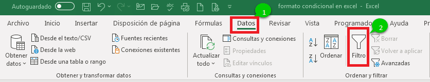
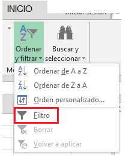

## Filtros en Excel

Los filtros en Excel, también conocido como Autofiltro, es una forma rápida de mostrar solo la información
relevante en un momento dado y eliminar todos los demás datos de la vista.

### Guía para agregar filtros en Excel

Podemos seguir 3 pasos para agregar filtro en Excel:

1. En la pestaña **Datos** , en el grupo **Ordenar y filtrar** , haga clic en el **botón Filtro**.

2. En la pestaña Inicio , en el grupo Edición , haga clic en Ordenar y filtrar > Filtrar.

> 
> Como atajo puedes utilizar Ctrl + Mayús + L para activar o desactivar los filtros.
>

>
> Una flecha desplegable en el encabezado de la columna significa que se agregó el filtrado, pero aún no se aplicó.
> Nos toca aplicar los filtro en base a la información que queremos analizar.
>

[Credito](https://siempreexcel.com/filtros-en-excel/)
